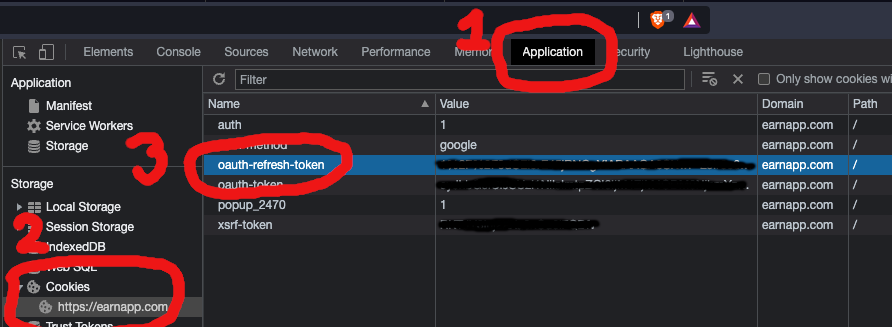

# EarnApp Ticker

A very simple console ticker showing the current balance, lifetime balance and the daily average earnings of an EarnApp account.

The original target platform for this simple ticker was a Pi Zero W with a cheap LCD screen. I created the ticker to prevent me from constantly looking at my phone to check the balance and getting distracted by other things.

An example of the output is shown below:

```
Current balance:


   #     ###            #     ###  
  ####  #   #          ##    #   # 
 # #        #           #    #   # 
  ###      #            #     #### 
   # #    #             #        # 
 ####    #       #      #       #  
   #    #####    #      #     ##   
                                   


Lifetime balance:


   #      ##          #####   ###  
  ####    ##          #   #  #   # 
 # #     # #              #      # 
  ###    # #             #      #  
   # #  #####            #     #   
 ####      #     #      #     #    
   #      ###    #      #    ##### 
                                   


Daily average:


   #     ###            #    ##### 
  ####  #   #          ##    #   # 
 # #    #  ##           #        # 
  ###   # # #           #       #  
   # #  ##  #           #       #  
 ####   #   #    #      #      #   
   #     ###     #      #      #  

```

## Setup

### Dependencies

The ticker makes use of the [fazalfarhan01/EarnApp-API](https://github.com/fazalfarhan01/EarnApp-API) library. Install the latest version by following the instructions below:

```
git clone https://github.com/fazalfarhan01/EarnApp-API
cd EarnApp-API
python3 setup.py install
```

- Clone the ticker repository and install the required packages

```
git clone https://github.com/richtamblyn/earnapp_ticker.git
cd earnapp_ticker
pip3 install -r requirements.txt
```

### EarnApp Credentials

The ticker code requires the EarnApp dashboard `oauth-refresh-token` to be set as an environment variable named `AUTH`.

- To retrieve the token, login to the EarnApp dashboard and press F12 to show the browser development tools.
- Click the 'Application' tab as indicated (labelled 1 in the screen grab below)
- Expand the 'Cookies' and click on `https://earnapp.com` (labelled 2 in the screen grab below)
- Copy the value in `oauth-refresh-token` (labelled 3 in the screen grab below)
- Depending on your platform, set an environment variable of `AUTH` to contain the token copied.



## Run the ticker

To run the ticker manually, enter the following:
```
cd earnapp_ticker
python ticker.py
```
